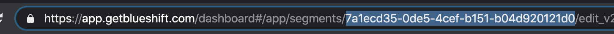
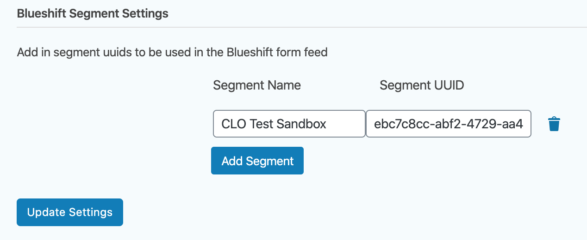
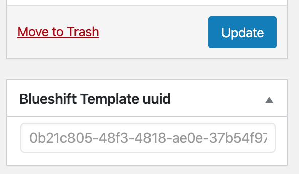
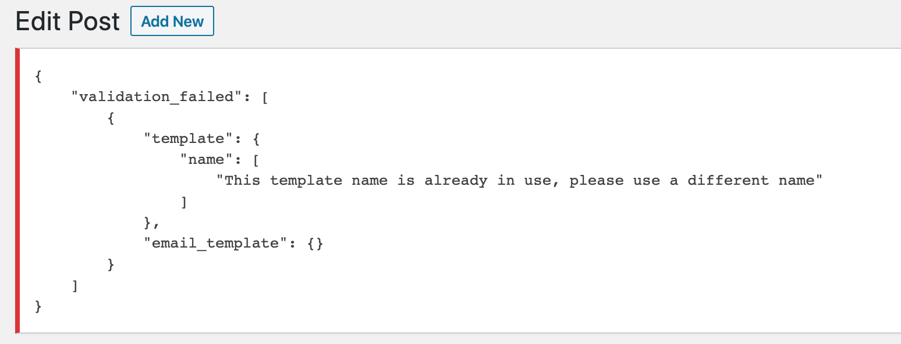
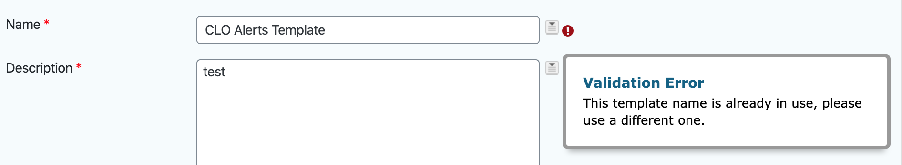

# Gravity Forms Blueshift Feed Add-On

Integrates Gravity Forms with Blueshift, allowing form submissions to be automatically sent as mailings via Blueshift.

Construct email content and send mailings via Blueshift using Gravity Forms.

## Installation

Requires Gravity Forms Version 1.9.14.26 or higher.

1. Download or clone the repo files and move them to the `wp-content/plugins/` folder of your WordPress site. You can also download the repo as a zip file and upload via the WordPress Dashboard.
2. Go to WordPress Dashboard > Plugins and activate Gravity Forms Blueshift.
3. Go to WordPress Dashboard > Forms > Settings > Blueshift.
4. Enter your Blueshift API credentials (URL and API key).

## How to use the Add-On

### Adding Segment uuids

1. Visit the Template you wish to use in the Blueshift interface and copy the uuid from the url.

2. Go to Go to WordPress Dashboard > Forms > Settings > Blueshift
3. Scroll down to the `Blueshift Segment Settings` add in a segment name and then paste
the segment into the `Segment UUID` input field that was copied from the url in Blueshift.

4. Repeat this for each segment that will be needed in the feeds.

### Template Creation

To create a template go to the `Blueshift Templates` custom post type on the wp admin menu.
Add in a post title and content.  

The `[FEEDCONTENT]` tag should be added into the post content
where ever you would like the feed content to be placed into the template when it is rendered. 

When the `Blueshift Template` is saved it will send the content and title of to Blueshift, the 
post `title` will be mapped to the template name in Blueshift and the post `content` will be mapped to 
the template body.  

If the template creation is successful
in Blueshift you will see a `uuid` appear in the `Blueshift Template uuid` meta box below the publish button:

If validation errors occur when the template is being created/updated in Blueshift, the validation
errors will be displayed at the top of the post edit screen:

If your Blueshift template contains errors, please update the template and save the post again to make
sure errors don't happen when the feed is processed after form submission.

### Feed Setup and Creation

To create a new Blueshift Feed, select a form in Gravity Forms, and go to `Settings > Blueshift`

#### Feed Settings

Enter in a feed name and select the Blueshift Segment you would like the email to go to when the feed
is processed.

#### Content Settings

Fill out the required fields and select the template you would like to use when the feed is processed.  
The `HTML Content` field is what will replace the `[FEEDCONTENT]` tag in the Blueshift template when the template 
is rendered.

On save, if there are validation issues with the template they will be displayed next to the field that 
has validation problems:

If errors occur please fix the field(s) and update the feed.

#### Mailing Settings

These fields will be mapped to the campaign in Blueshift. There are two types of mailings that can be used 
`Scheduled` and `Immediate`, if a `Scheduled` mailing is used, it will simply add the input of the `Mailing Delay in Minutes`
field to the start time of the campaign.

## Development Setup

To develop this plugin, all you need is an active WordPress installation with Gravity Forms installed.

### Development Resources

[Gravity Forms Add-On Framework Documentation][gfaddonframework]

[Blueshift API Documentation][blueshiftsapicalls]

## Release History

<!-- * 1.0.0
    * The first proper release -->
* 0.0.1
    * First build out

## Contributing

1. Fork it (<https://github.com/yourname/yourproject/fork>)
2. Create your feature branch (`git checkout -b feature/fooBar`)
3. Commit your changes (`git commit -am 'Add some fooBar'`)
4. Push to the branch (`git push origin feature/fooBar`)
5. Create a new Pull Request

<!-- Markdown link & img dfn's -->
[gfaddonframework]: https://docs.gravityforms.com/category/developers/php-api/add-on-framework/
[blueshiftsapicalls]: https://developer.blueshift.com/reference